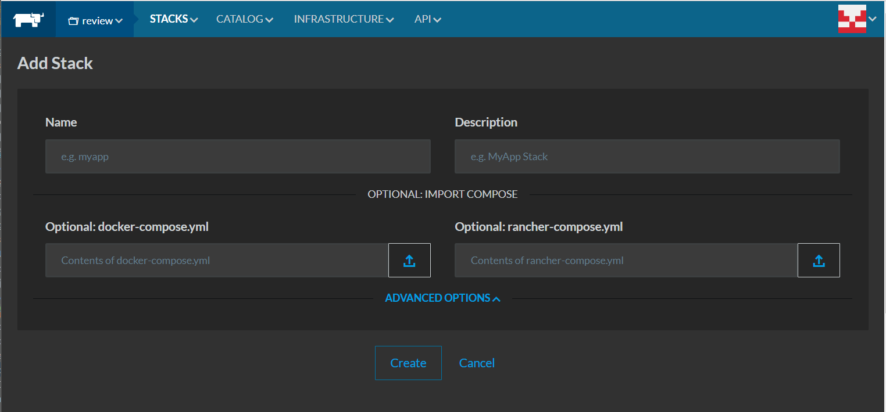

# integrated-cart

To run the Java Consumer contract tests:
`./gradlew test`

To run the JS Consumer contract tests from the repo's root directory:
`npm test --prefix cartJsConsumer`

To deploy the documentation:
```
cd docs
docker build -t docker-dev.global.dish.com/integrated_cart_documentation:latest .
docker push docker-dev.global.dish.com/integrated_cart_documentation:latest
```


In your browser navigate to:
https://rancher-np.global.dish.com/env/1a172/apps/stacks/add



Name: ihs-integrated-cart  
Description <leave blank>  
Optional: docker-compose.yml docker-compose/ihs-integrated-cart.yml  
Optional: rancher-compose.yml docker-compose/ihs-integrated-cart-rancher.yml  
  
and press Create.  
